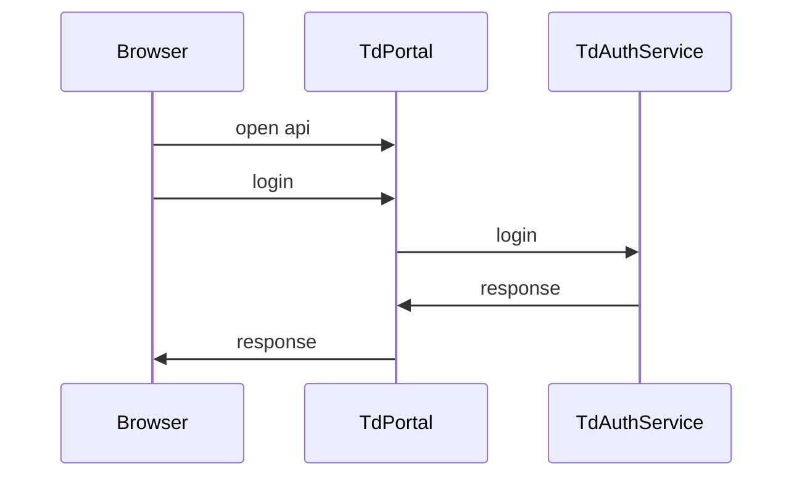

不用springsecurity

1. 网关：如果为公开的API，则直接通过

   如果是非公开的API，则取token；无token则返回失败；有token则检查token是否有效并检查权限

2. 服务：过滤器中，取token，若有token则取用户信息；若无token则不管

<http://www.ruanyifeng.com/blog/2014/05/oauth_2_0.html>

Spring Cloud 基于网关的统一授权认证

<https://gitee.com/xingfly/Spring-CloudJiYuZuulDeTongYiShouQuanRenZheng>

Spring Cloud实战小贴士：Zuul处理Cookie和重定向

<http://blog.didispace.com/spring-cloud-zuul-cookie-redirect/>

记录在使用 OAuth2 遇到的巨坑

<http://www.shangyang.me/2017/06/01/spring-cloud-oauth2-zuul-potholes/>

认证

鉴权

