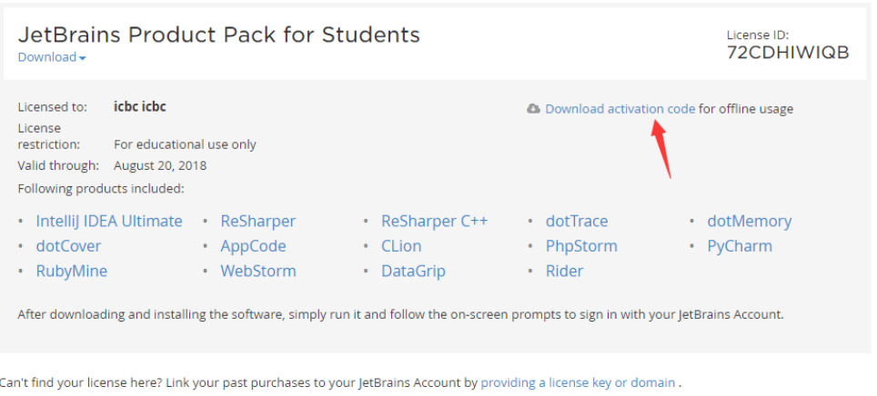

# 快捷键


**`IntelliJ IDEA` 官方出的学习辅助插件：`IDE Features Trainer`**

`Ctrl+Alt+剪头`: 前进后退

`Ctrl+Alt+H`: 查询某方法被其它地方调用

`Ctrl+N`: 定位文件，文件名后加`:数字`跳到指定行

`psvm`: 快速输入main函数

` Ctrl+J`: 键入 main再按，快速输入main函数

`sout `: 快速输入System.out.println

`fori`: 快速生成普通for循环

`iter`: for-each循环

`F11`: 添加书签


# 配置


需要初始界面设置，不能打开项目后再设置，不然一此设置项目会不启作用  

0. 设置个性化配置目录及系统文件目录  
[IntelliJ IDEA 相关核心文件和目录介绍](http://www.phperz.com/article/15/0923/159061.html)  
`idea.config.path=${user.home}/.IntelliJIdea/config`，该属性主要用于指向 IntelliJ IDEA 的个性化配置目录，默认是被注释，打开注释之后才算启用该属性，这里需要特别注意的是斜杠方向，这里用的是正斜杠。  
`idea.system.path=${user.home}/.IntelliJIdea/system`，该属性主要用于指向 IntelliJ IDEA 的系统文件目录，默认是被注释，打开注释之后才算启用该属性，这里需要特别注意的是斜杠方向，这里用的是正斜杠。如果你的项目很多，则该目录会很大，如果你的 C 盘空间不够的时候，还是建议把该目录转移到其他盘符下。  
`idea.max.intellisense.filesize=2500`，该属性主要用于提高在编辑大文件时候的代码帮助。IntelliJ IDEA 在编辑大文件的时候还是很容易卡顿的。  
`idea.cycle.buffer.size=1024`，该属性主要用于控制控制台输出缓存。有遇到一些项目开启很多输出，控制台很快就被刷满了没办法再自动输出后面内容，这种项目建议增大该值或是直接禁用掉，禁用语句`idea.cycle.buffer.size=disabled`。  

1. 设置主题  
  `Settings | Appearance & Behavior | Appearance`  

2. 不自更新  
  `Settings | Appearance & Behavior | System Settings | Updates`  

3. 设置字体  
  `Settings | Editor | Colors & Fonts | Font`  Colsolas 16  
  `Settings | Editor | Colors & Fonts | Console Font`  

4. 设置github账号  
  `Settings | Version Control | GitHub`  

5. 设置Maven  
  `Settings | Build,Execution,Deployment | Build Tools | Maven`  
  设置 Maven home directory 为绝对路径地址  
  设置 User settings file为Maven home下的conf/settings.xml配置  
  设置 User settings file 与 Local repository 为Override  
  `Settings | Build,Execution,Deployment | Build Tools | Maven | Importing`  
  设置自动下载源码及文档 

6. 设置diff为Beyond Compared  

7. 不显示`.idea`与`iml`文件  
  `Settings | Editor | File Types --> Ingore files and folders`  
  在后面添加 `*.idea;*.iml;`  

8. 设置默认换行格式  
  `Settings | Editor | Code Style --> Line Separator`  

9. 设置propeties文件默认编码为UTF-8  
  `Settings | Editor | File Encodings `  

10. 安装markdown插件  
[IntelliJ IDEA Multi-MarkDown插件安装破J全过程](http://www.jianshu.com/p/a0550f81cbd1)  


# 学生版本授权


打开两个网页

<https://www.jetbrains.com/idea/buy>  （JetBrains购买页面）

<https://free.kirito.edu.rs>    （临时邮箱）


使用临时邮箱到JetBrains购买页面，注册学生授权


注意，在临时邮箱时，收到邮件后，邮件中内容的链接，使用右键在新标签页中打开

在临时邮箱中，收到确认邮件


在回到临时邮箱，贴到激活邮件


在下面这里下载激活码



下面为个人申请的激活码，可以正常使用

```
byvebee3m
byvebee@3m

ZIP0W73L0P-eyJsaWNlbnNlSWQiOiJaSVAwVzczTDBQIiwibGljZW5zZWVOYW1lIjoiYnl2ZSBiZWUiLCJhc3NpZ25lZU5hbWUiOiIiLCJhc3NpZ25lZUVtYWlsIjoiIiwibGljZW5zZVJlc3RyaWN0aW9uIjoiRm9yIGVkdWNhdGlvbmFsIHVzZSBvbmx5IiwiY2hlY2tDb25jdXJyZW50VXNlIjpmYWxzZSwicHJvZHVjdHMiOlt7ImNvZGUiOiJJSSIsInBhaWRVcFRvIjoiMjAxOS0wNC0xNCJ9LHsiY29kZSI6IlJTMCIsInBhaWRVcFRvIjoiMjAxOS0wNC0xNCJ9LHsiY29kZSI6IldTIiwicGFpZFVwVG8iOiIyMDE5LTA0LTE0In0seyJjb2RlIjoiUkQiLCJwYWlkVXBUbyI6IjIwMTktMDQtMTQifSx7ImNvZGUiOiJSQyIsInBhaWRVcFRvIjoiMjAxOS0wNC0xNCJ9LHsiY29kZSI6IkRDIiwicGFpZFVwVG8iOiIyMDE5LTA0LTE0In0seyJjb2RlIjoiREIiLCJwYWlkVXBUbyI6IjIwMTktMDQtMTQifSx7ImNvZGUiOiJSTSIsInBhaWRVcFRvIjoiMjAxOS0wNC0xNCJ9LHsiY29kZSI6IkRNIiwicGFpZFVwVG8iOiIyMDE5LTA0LTE0In0seyJjb2RlIjoiQUMiLCJwYWlkVXBUbyI6IjIwMTktMDQtMTQifSx7ImNvZGUiOiJEUE4iLCJwYWlkVXBUbyI6IjIwMTktMDQtMTQifSx7ImNvZGUiOiJHTyIsInBhaWRVcFRvIjoiMjAxOS0wNC0xNCJ9LHsiY29kZSI6IlBTIiwicGFpZFVwVG8iOiIyMDE5LTA0LTE0In0seyJjb2RlIjoiQ0wiLCJwYWlkVXBUbyI6IjIwMTktMDQtMTQifSx7ImNvZGUiOiJQQyIsInBhaWRVcFRvIjoiMjAxOS0wNC0xNCJ9LHsiY29kZSI6IlJTVSIsInBhaWRVcFRvIjoiMjAxOS0wNC0xNCJ9XSwiaGFzaCI6Ijg3MTk5MTIvMCIsImdyYWNlUGVyaW9kRGF5cyI6MCwiYXV0b1Byb2xvbmdhdGVkIjpmYWxzZSwiaXNBdXRvUHJvbG9uZ2F0ZWQiOmZhbHNlfQ==-T4kmT+0Sq6AR9MbIkQk6bUmSu6r/IEgXjv29Ip03MfFaYiK/QBq8YUJtmxVvTRdYE81gPHHJlZQs5dO9j5LlocfTzfNYkQSY4kKdQvsIPI+iUNgZdQYT1OQQrxLpqEFtVxgTBkkAlMhQ0APjv8U59DapnUwEjZFnH7fixRGSGlgJgfooQFnm/0v0BDl5iE7QvPTPF/NTXBWT8m/cUKwJdLh/7oKcbofAXQ60/jtqvq2eseTSsIFa3aBgg0fKnHoTDHDcm/x0rXmJR0dH/mUG5k5l2Cpa9mTbd3Mtny2sZXPVe8hbKWh8SMf6tuF6r9S9JE6mDTcbMBMtpPHR3Tg5kA==-MIIEPjCCAiagAwIBAgIBBTANBgkqhkiG9w0BAQsFADAYMRYwFAYDVQQDDA1KZXRQcm9maWxlIENBMB4XDTE1MTEwMjA4MjE0OFoXDTE4MTEwMTA4MjE0OFowETEPMA0GA1UEAwwGcHJvZDN5MIIBIjANBgkqhkiG9w0BAQEFAAOCAQ8AMIIBCgKCAQEAxcQkq+zdxlR2mmRYBPzGbUNdMN6OaXiXzxIWtMEkrJMO/5oUfQJbLLuMSMK0QHFmaI37WShyxZcfRCidwXjot4zmNBKnlyHodDij/78TmVqFl8nOeD5+07B8VEaIu7c3E1N+e1doC6wht4I4+IEmtsPAdoaj5WCQVQbrI8KeT8M9VcBIWX7fD0fhexfg3ZRt0xqwMcXGNp3DdJHiO0rCdU+Itv7EmtnSVq9jBG1usMSFvMowR25mju2JcPFp1+I4ZI+FqgR8gyG8oiNDyNEoAbsR3lOpI7grUYSvkB/xVy/VoklPCK2h0f0GJxFjnye8NT1PAywoyl7RmiAVRE/EKwIDAQABo4GZMIGWMAkGA1UdEwQCMAAwHQYDVR0OBBYEFGEpG9oZGcfLMGNBkY7SgHiMGgTcMEgGA1UdIwRBMD+AFKOetkhnQhI2Qb1t4Lm0oFKLl/GzoRykGjAYMRYwFAYDVQQDDA1KZXRQcm9maWxlIENBggkA0myxg7KDeeEwEwYDVR0lBAwwCgYIKwYBBQUHAwEwCwYDVR0PBAQDAgWgMA0GCSqGSIb3DQEBCwUAA4ICAQC9WZuYgQedSuOc5TOUSrRigMw4/+wuC5EtZBfvdl4HT/8vzMW/oUlIP4YCvA0XKyBaCJ2iX+ZCDKoPfiYXiaSiH+HxAPV6J79vvouxKrWg2XV6ShFtPLP+0gPdGq3x9R3+kJbmAm8w+FOdlWqAfJrLvpzMGNeDU14YGXiZ9bVzmIQbwrBA+c/F4tlK/DV07dsNExihqFoibnqDiVNTGombaU2dDup2gwKdL81ua8EIcGNExHe82kjF4zwfadHk3bQVvbfdAwxcDy4xBjs3L4raPLU3yenSzr/OEur1+jfOxnQSmEcMXKXgrAQ9U55gwjcOFKrgOxEdek/Sk1VfOjvS+nuM4eyEruFMfaZHzoQiuw4IqgGc45ohFH0UUyjYcuFxxDSU9lMCv8qdHKm+wnPRb0l9l5vXsCBDuhAGYD6ss+Ga+aDY6f/qXZuUCEUOH3QUNbbCUlviSz6+GiRnt1kA9N2Qachl+2yBfaqUqr8h7Z2gsx5LcIf5kYNsqJ0GavXTVyWh7PYiKX4bs354ZQLUwwa/cG++2+wNWP+HtBhVxMRNTdVhSm38AknZlD+PTAsWGu9GyLmhti2EnVwGybSD2Dxmhxk3IPCkhKAK+pl0eWYGZWG3tJ9mZ7SowcXLWDFAk0lRJnKGFMTggrWjV8GYpw5bq23VmIqqDLgkNzuoog==
```

